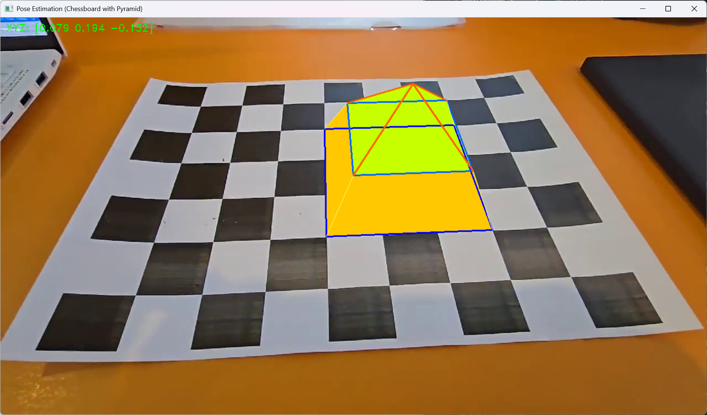

# You-can-be-a-sphinx
당신은 피라미드 앞을 지키는 스핑크스가 될 수 있습니다

## 카메라 자세 추정 및 증강현실(AR) 물체 시각화

이 프로젝트는 **체스보드 패턴을 활용한 카메라 자세 추정(Camera Pose Estimation)** 과  
**OpenCV를 활용한 증강현실(AR) 물체 렌더링**을 구현한 과제입니다.

영상 속 체스보드 패턴을 인식하고, 이를 기반으로 **3차원 피라미드 형태의 AR 물체**를 화면에 정확한 위치와 방향으로 표시합니다.

---

### 전체 구조조

- **카메라 자세 추정**  
  직접 캘리브레이션한 내 카메라의 내부 파라미터를 이용하여, 체스보드 영상에서 카메라의 위치 및 자세를 추정합니다.

- **AR 물체 시각화**   
  본 프로젝트에서는 **2단 구조의 피라미드** 형태의 도형을 3D로 구현하였습니다.

---

### 카메라 캘리브레이션

이전 과제에서 직접 촬영한 체스보드 이미지를 활용해 카메라의 내부 파라미터를 구했습니다.  
`calibration_data.npz` 파일을 통해 아래 정보를 불러옵니다.

- `mtx`: 카메라 내부 행렬 (Intrinsic Matrix)
- `dist`: 왜곡 계수 (Distortion Coefficients)

```python
data = np.load('calibration_data.npz')
K = data['mtx']
dist_coeff = data['dist']
```

### 피라미드 3D 좌표 생성

피라미드는 2단이며 1단 밑면이 (3 X 3) 형태로 크게, 2단 밑면이 (2 X 2) 형태로 보다 작게 구성했습니다.
맨 위쪽 꼭짓점은 2층 높이 이므로 z축을 -2로 설정했습니다.

```python
# === 밑면 1 (3x3 큰 밑면) ===
base_bottom = board_cellsize * np.array([
    [3, 1, 0],
    [6, 1, 0],
    [6, 4, 0],
    [3, 4, 0],
])

# === 밑면 2 (2x2 작은 밑면, 중간 층) ===
base_middle = board_cellsize * np.array([
    [3.5, 1.5, -1],
    [5.5, 1.5, -1],
    [5.5, 3.5, -1],
    [3.5, 3.5, -1],
])

apex = board_cellsize * np.array([[4.5, 2.5, -2]])
```

### 피라미드 AR 시각화 구현

위에서 정의한 3D 피라미드 좌표는 OpenCV의 projectPoints()를 통해 2D 이미지 상의 좌표로 투영됩니다.
이 좌표를 활용해 실제 영상 프레임 위에 AR 피라미드를 그려넣습니다.

```python
# 3D → 2D 투영
pyramid_pts_2d, _ = cv.projectPoints(pyramid_pts_3d, rvec, tvec, K, dist_coeff)
pts = np.int32(pyramid_pts_2d).reshape(-1, 2)
```

### 렌더링 방식

피라미드는 총 9개의 3D 포인트로 구성되며, 이를 바탕으로 아래와 같이 각 면을 시각화합니다.
밑면 채우기 : 가장 아래의 1층 밑면은 노란색으로 채워 강조합니다.

```python
cv.fillConvexPoly(img, pts[:4], color=(0, 255, 255))
```

1층 측면 : 큰 1층과 2층을 연결한 네 개의 측면은 어두운 노란색으로 채워집니다.

```python
for i in range(4):
    side = np.array([pts[i], pts[(i+1)%4], pts[(i+1)%4 + 4], pts[i + 4]])
    cv.fillConvexPoly(img, side, (0, 200, 255))
```

2층 밑면 : 두 번째 밑면(중간층)은 밝은 노랑-초록색으로 시각화합니다.

```python
cv.fillConvexPoly(img, pts[4:8], (0, 255, 180))
```

2층 측면 : 중간층과 꼭짓점을 연결하는 측면 4개는 연한 초록-노란색으로 구성되어 피라미드 느낌을 강조합니다.

```python
for i in range(4):
    triangle = np.array([pts[i + 4], pts[(i+1)%4 + 4], pts[8]])
    cv.fillConvexPoly(img, triangle, (0, 255, 200))
```

### 선 그리기

각 층의 밑면 윤곽선과 측면 연결 선을 그려 3D 구조를 보다 명확하게 표현합니다.

```python
cv.polylines(img, [pts[0:4]], isClosed=True, color=(255, 0, 0), thickness=2)  # 1층 테두리
cv.polylines(img, [pts[4:8]], isClosed=True, color=(255, 100, 0), thickness=2)  # 2층 테두리

for i in range(4):
    cv.line(img, pts[i], pts[i + 4], (100, 255, 255), 1)  # 1층 → 2층
    cv.line(img, pts[i + 4], pts[8], (0, 100, 255), 2)    # 2층 → 꼭짓점
```

### 카메라 위치 시각화

카메라의 3차원 위치는 회전 행렬과 변환 벡터를 통해 계산되며, 이를 화면 좌측 상단에 텍스트로 출력합니다.

```python
R, _ = cv.Rodrigues(rvec)
p = (-R.T @ tvec).flatten()
info = f'XYZ: [{p[0]:.3f} {p[1]:.3f} {p[2]:.3f}]'
cv.putText(img, info, (10, 25), cv.FONT_HERSHEY_DUPLEX, 0.6, (0, 255, 0))
```

### 결과



### 실행 방법

1. 필수 파일 준비
   * my_chessboard.mp4 : 체스보드가 포함된 비디오
   * calibration_data.npz : 캘리브레이션 정보
   * poes_estimation_pyramid.py : 본 프로젝트의 메인 코드

2. 실행 시 기능
   * 실시간으로 AR 피라미드가 영상 위에 표시
   * 카메라 위치가 화면에 출력
   * ESC 키를 누르면 종료


